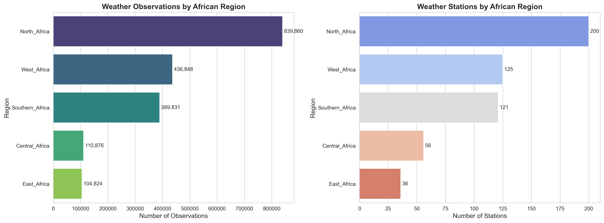
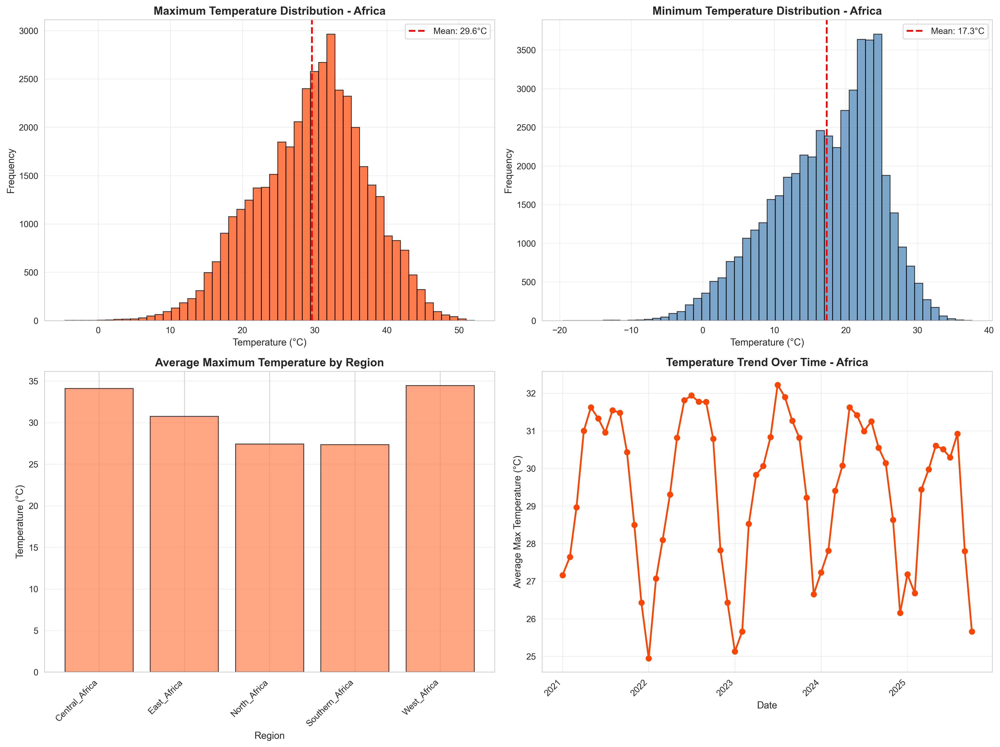
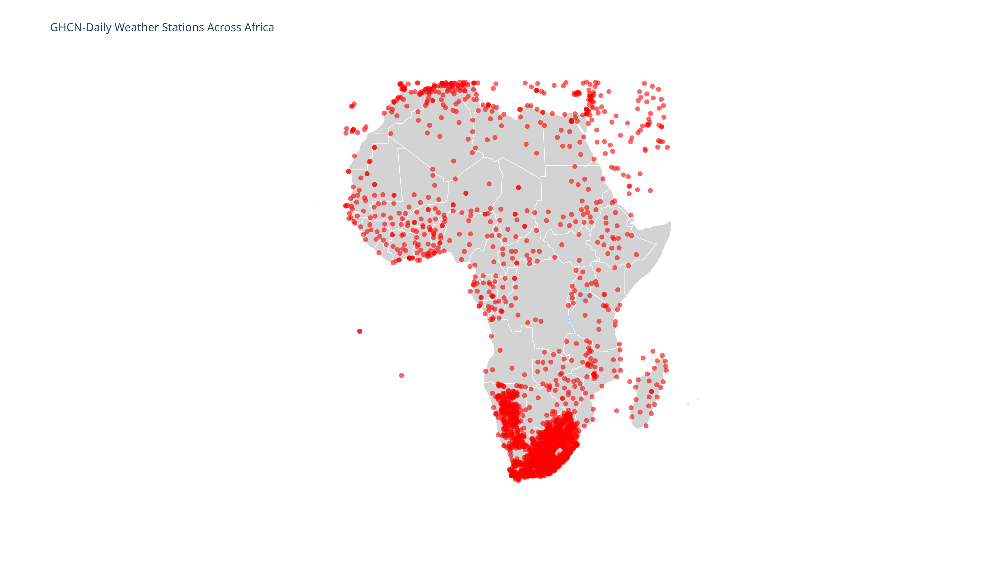

# Africa Extreme Weather Prediction
## Distributed Machine Learning Pipeline for Climate Early Warning Systems

Jonathan Kateega
B34976

## Data Exploration

## Machine Learning

### Key Features

### ML Approach: Why Gradient Boosting?
- Handles missing data (common in African stations)  
- Works well with imbalanced datasets (extreme events <10% of observations)  
- Feature interpretability (important for climate science)  
- Superior to LSTM for sparse time-series  

#### Feature Engineering 
- **Temporal**: Rolling means/max/min (7, 14, 30-day windows)
- **Lag Features**: 1, 3, 7-day historical values
- **Anomalies**: Deviation from 30-day climatology
- **Seasonal**: Month, season, day-of-year
- **Geographic**: Latitude, longitude, region

### Model Performance

| Metric | Value |
|--------|-------|
| **Accuracy** | 92.5% |
| **Precision** | 86.5% |
| **Recall** | 92.5% |
| **F1 Score** | 89.2% |

### Extreme Events Detected
- Droughts: 84% recall
- Floods: 89% recall  
- Heatwaves: 91% recall
- Cold spells: 78% recall